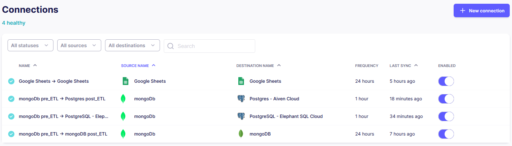
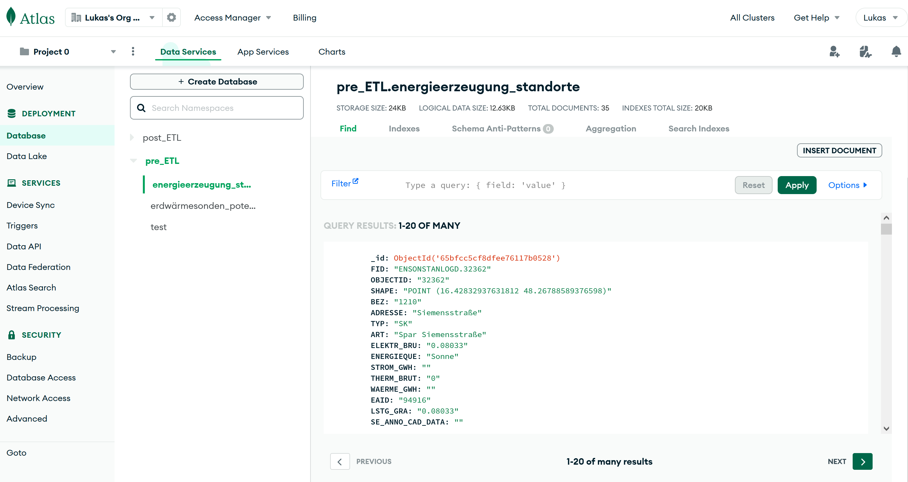
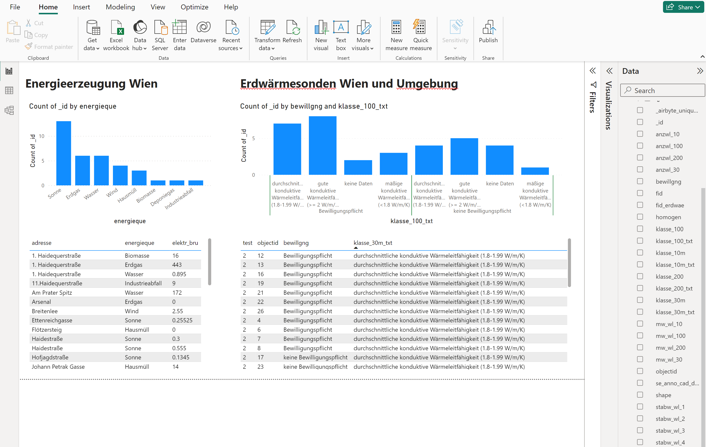

# ETL-pipeline

This document outlines the technical design and objectives of a project focused on demonstrating the construction and operation of an ETL (Extract, Transform, Load) pipeline. The project leverages a variety of data sources, integrating them into a cohesive architecture developed from the ground up. The core components of this architecture include MongoDB, ElephantSQL Cloud (PostgreSQL), and simple Google Sheets, all of which serve as foundational data storage and management systems. These databases will be populated and manipulated through Python scripts, employing ETL methodologies using Airbyte to facilitate data flow and transformation ETL approaches. Finally, we visualize the transformed data in Microsoft Power BI.

## Table of Contents
- [Getting Started](#getting-started)
- [Built With](#built-with)
  - [ETL Pipelines in Airbyte](#etl-pipelines-in-airbyte)
  - [MongoDB](#mongo-db)
  - [ElephantSQL - PostgreSQL Cloud](#elephant-sql)
  - [PowerBI Visualization of ETL transformed data](#power-bi)
- [Deployment](#deployment)

## Getting Started

These instructions will get you a copy of the project up and running on your local machine for development and testing purposes. 
See deployment for notes on how to deploy the project on a live system.

### Prerequisites

### Installation

## Build with

### ETL Pipelines in Airbyte

The screenshot below shows all ETL pipelines that have been set up via Airbyte: 

    

### MongoDB
The screenshot below shows the MongoDB data entries that have been added via python scripts:

    

### ElephantSQL - PostgreSQL Cloud
The screenshot below shows the PostgreSQL database that got connected to the MongoDB via ETL-Airbyte pipeline:

    

### PowerBI Visualization of ETL transformed data
The screenshot below shows all ETL pipelines that have been set up via Airbyte in powerBI:

    

