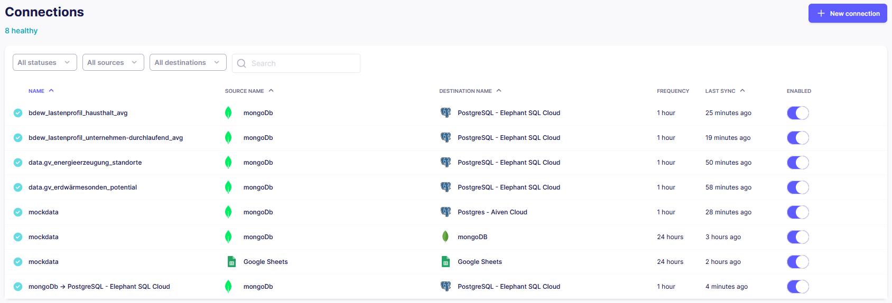

# ETL-pipeline

This document outlines the technical design and objectives of a project focused on demonstrating the construction and operation of an ETL (Extract, Transform, Load) pipeline. The project leverages a variety of data sources, integrating them into a cohesive architecture developed from the ground up. The core components of this architecture include MongoDB, ElephantSQL Cloud (PostgreSQL), and simple Google Sheets, all of which serve as foundational data storage and management systems. These databases will be populated and manipulated through Python scripts, employing ETL methodologies using Airbyte to facilitate data flow and transformation ETL approaches. Finally, we visualize the transformed data in Microsoft Power BI.

## Table of Contents

- [Project Title](#project-title)
- [Table of Contents](#table-of-contents)
- [Getting Started](#getting-started)
  - [Prerequisites](#prerequisites)
  - [Installation](#installation)
- [Usage](#usage)
- [Running the Tests](#running-the-tests)
  - [Break Down into End to End Tests](#break-down-into-end-to-end-tests)
  - [And Coding Style Tests](#and-coding-style-tests)
- [Deployment](#deployment)
- [Built With](#built-with)
- [Contributing](#contributing)
- [Versioning](#versioning)
- [Authors](#authors)
- [License](#license)
- [Acknowledgments](#acknowledgments)

## Getting Started

These instructions will get you a copy of the project up and running on your local machine for development and testing purposes. See deployment for notes on how to deploy the project on a live system.

### Prerequisites

### ETL Pipelines in Airbyte

The screenshot below shows all ETL pipelines that have been set up via Airbyte:

Simple POC using Airbyte:
google doc source: https://docs.google.com/spreadsheets/d/1Uokt_5GApDgxYLjAUY39XIMq9jDB9PB5MhueVdzDww4/edit
google doc ETL result: https://docs.google.com/spreadsheets/d/1jOhQfxEEoHNI5DbdtPpdFxITooR_biCAR1WSQkC6K7k/edit#gid=0
